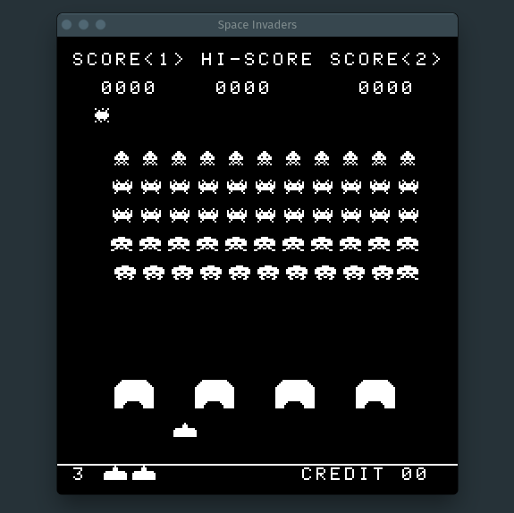

# Invaders8080

An intel 8080 and Space Invaders emulator written in Go.



## Build

```sh
go get && go build
```

this will create an `invaders8080` executable.

## Usage

```sh
./invaders8080 path/to/SpaceInvadersRom
```

